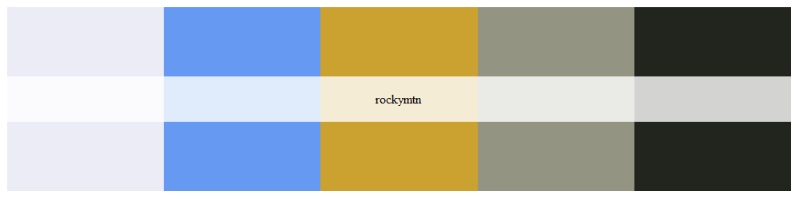
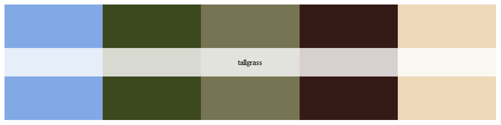
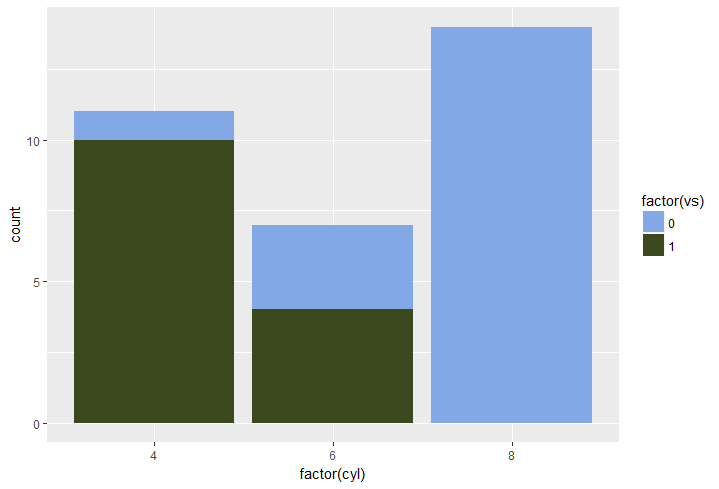

```{r setup, include = FALSE}
knitr::opts_chunk$set(
  collapse = TRUE,
  comment = "#>"
)
```

# See all palettes

Vignettes are long form documentation commonly included in packages. Because they are part of the distribution of the package, they need to be as compact as possible. The `html_vignette` output type provides a custom style sheet (and tweaks some options) to ensure that the resulting html is as small as possible. The `html_vignette` format:

- Never uses retina figures
- Has a smaller default figure size
- Uses a custom CSS stylesheet instead of the default Twitter Bootstrap style

## Vignette Info

Note the various macros within the `vignette` section of the metadata block above. These are required in order to instruct R how to build the vignette. Note that you should change the `title` field and the `\VignetteIndexEntry` to match the title of your vignette.

## Styles

The `html_vignette` template includes a basic CSS theme. To override this theme you can specify your own CSS in the document metadata as follows:

    output: 
      rmarkdown::html_vignette:
        css: mystyles.css

## Figures

The figure sizes have been customized so that you can easily put two images side-by-side. 

```{r, fig.show='hold'}
plot(1:10)
plot(10:1)
```
Usage
-----

``` r
library(nationalpark)

# See all palettes
names(nationalpark)
#>  [1] "BottleRocket1"  "BottleRocket2"  "Rushmore1"      "Rushmore"      
#>  [5] "Royal1"         "Royal2"         "Zissou1"        "Darjeeling1"   
#>  [9] "Darjeeling2"    "Chevalier1"     "FantasticFox1"  "Moonrise1"     
#> [13] "Moonrise2"      "Moonrise3"      "Cavalcanti1"    "GrandBudapest1"
#> [17] "GrandBudapest2" "IsleofDogs1"    "IsleofDogs2"
```

Palettes
--------

### Rocky Mountain National Park, Colorado

``` r
np_palette("rockymtn")
```




### Tallgrass National Park

``` r
np_palette("tallgrass")
```




``` r
library("ggplot2")
ggplot(mtcars, aes(factor(cyl), fill=factor(vs))) +  geom_bar() +
  scale_fill_manual(values = np_palette("tallgrass"))
```


You can enable figure captions by `fig_caption: yes` in YAML:

    output:
      rmarkdown::html_vignette:
        fig_caption: yes

Then you can use the chunk option `fig.cap = "Your figure caption."` in **knitr**.

## More Examples

You can write math expressions, e.g. $Y = X\beta + \epsilon$, footnotes^[A footnote here.], and tables, e.g. using `knitr::kable()`.

```{r, echo=FALSE, results='asis'}
knitr::kable(head(mtcars, 10))
```

Also a quote using `>`:

> "He who gives up [code] safety for [code] speed deserves neither."
([via](https://twitter.com/hadleywickham/status/504368538874703872))
