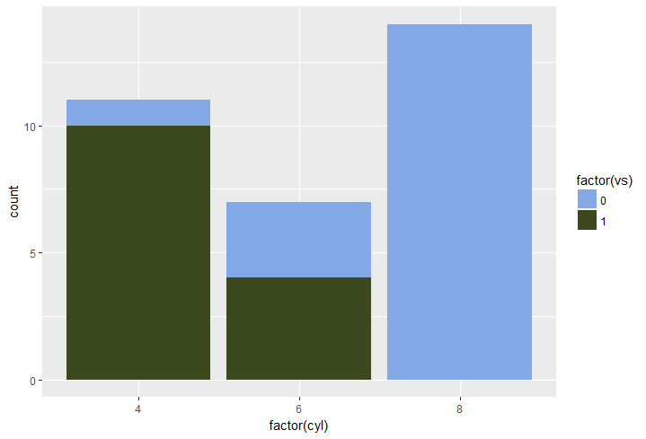

<!-- README.md is generated from README.Rmd. Please edit that file -->
National Park Palettes
=====================

![(images/yellowstone_vintage.jpg)]

> Yellowstone National Park

Tired of generic mass produced palettes for your plots? 

Installation
------------

``` r
install.packages("nationalpark")
```

**Or the development version**

``` r
devtools::install_github("atkinsjeff/nationalpark")
```

Usage
-----

``` r
library("nationalpark")


Palettes
--------

### Rocky Mountain National Park, Colorado

    np_palette("rockymtn")

 

### Tallgrass National Park

    np_palette("tallgrass")


    library("ggplot2")
    ggplot(mtcars, aes(factor(cyl), fill=factor(vs))) +  geom_bar() +
      scale_fill_manual(values = np_palette("tallgrass"))

 You can enable figure captions by
`fig_caption: yes` in YAML:

    output:
      rmarkdown::html_vignette:
        fig_caption: yes

Then you can use the chunk option `fig.cap = "Your figure caption."` in
**knitr**.


Also a quote using `>`:

> "He who gives up \[code\] safety for \[code\] speed deserves neither."
> ([via](https://twitter.com/hadleywickham/status/504368538874703872))

[1] A footnote here.
